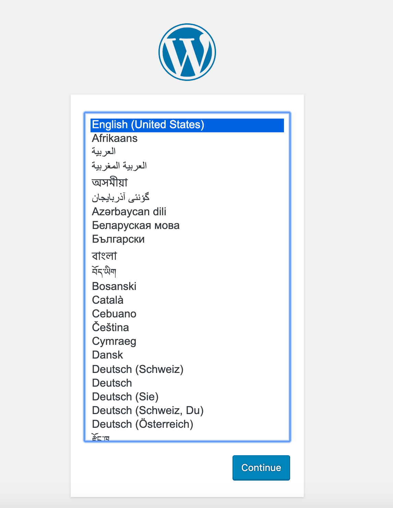

# Guia de Instalação do WordPress no Docker

## Pré-requisitos

Certifique-se de que os seguintes pré-requisitos estejam instalados no seu sistema:

1. Docker
2. Docker Compose

## Instalação

### Passo 1: Atualize a lista de pacotes

Execute o seguinte comando para atualizar a lista de pacotes:

```bash
sudo apt-get update
```

### Passo 2: Crie um diretório para o WordPress

Crie um diretório onde o WordPress será instalado. Por exemplo:

```bash
mkdir wordpress
```

Dentro deste diretório, crie um novo arquivo chamado docker-compose.yml utilizando qualquer editor de texto.

### Passo 3: Configure o arquivo docker-compose.yml

Cole o seguinte conteúdo no arquivo docker-compose.yml e salve as alterações:

```bash
version: '3.1'

services:

  wordpress:
    image: wordpress
    restart: always
    ports:
      - 8080:80
    environment:
      WORDPRESS_DB_HOST: db
      WORDPRESS_DB_USER: exampleuser
      WORDPRESS_DB_PASSWORD: examplepass
      WORDPRESS_DB_NAME: exampledb
    volumes:
      - wordpress:/var/www/html

  db:
    image: mysql:5.7
    restart: always
    environment:
      MYSQL_DATABASE: exampledb
      MYSQL_USER: exampleuser
      MYSQL_PASSWORD: examplepass
      MYSQL_RANDOM_ROOT_PASSWORD: '1'
    volumes:
      - db:/var/lib/mysql

volumes:
  wordpress:
  db:
```

### Passo 4: Execute o WordPress no Docker

Para iniciar o WordPress no Docker, execute o seguinte comando:
    
```bash
docker-compose up -d
```

### Passo 5: Acesse o WordPress

Abra seu navegador e acesse o WordPress no endereço http://localhost:8080. Você verá a página inicial do WordPress.



### Passo 6: Interromper a Imagem

Para interromper a aplicação, execute:

```bash
docker-compose down
```

### Passo 7: Remontar Imagem

Se você precisar remontar a imagem WordPress execute:

```bash
docker-compose up -d --build
```

Agora você concluiu com sucesso a instalação do WordPress usando Docker.